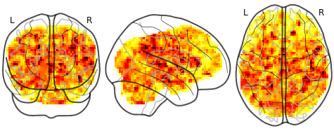
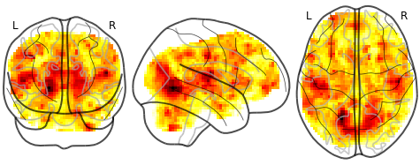
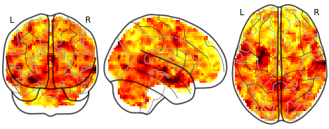
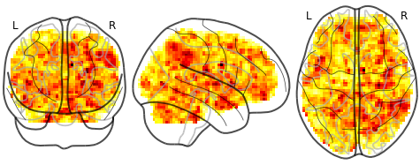

##imageSearch

Python image search for brain images

Adapted from [pyimagesearch](http://www.pyimagesearch.com/2014/12/01/complete-guide-building-image-search-engine-python-opencv/). See "example.py" for how to run the script. Credits go to @jrosebr1

#### 1)
We first generate a "mask" from which we will extract features. Each square in the grid will have a complete color histogram extracted, and empty squares will not be used. For example, here are the areas for a grid of size 20:

This spatial mask could be anything that is desired for the image. For brain images, we could (possibly) improve our method by using regional masks.

#### 2) 
We generate a database of such histrogram features for all of the images in the "img" folder. A reasonable grid size of 60 will generate 6048 features.

      mask="/home/vanessa/Documents/Dropbox/Code/Python/imageSearch/img/empty.png"
      dataset="img/"

      python index.py --dataset $dataset --mask $mask --index index.csv --gridsize 60

#### 3)
We the take a query image (one of the images from the set) and run a search:

      python search.py --index index.csv --mask $mask --query "img/0755.png" --result-path $dataset --gridsize 60

      Similar image 0 is 0755.png, score: 5.01683098279e-12
      Similar image 1 is 0758.png, score: 0.753928549838
      Similar image 2 is 0735.png, score: 1.49185219648
      Similar image 3 is 0575.png, score: 1.57747888024
      Similar image 4 is 2531.png, score: 1.58183379819
      Similar image 5 is 2577.png, score: 1.65715516378
      Similar image 6 is 1102.png, score: 1.69818982149
      Similar image 7 is 0573.png, score: 1.82857227454
      Similar image 8 is 1100.png, score: 1.83202124991
      Similar image 9 is 0090.png, score: 1.86576392466

##### Query image

##### Top 5 Most Similar

A score of (essentially) zero == the same image, and increasing from that == less similar. This could be streamlined for feature extraction and easily integrated into a python module with a better visualization output, django, etc. Compared to an image search using the actual brain map, we have [2 overlapping results](http://neurovault.org/images/755/find_similar) (images 758 and 735) in the top 10.  Very cool! :O)
